# Database ER Diagram - MS-Contratti

Questo documento rappresenta la struttura del database del microservizio MS Contratti attraverso un diagramma Entity-Relationship (ER).

## Struttura Database

Il database è composto da queste entità principali:
- **Contraenti**: Tabella principale contenente i dati dei contraenti (clienti ed enti)
- **Contratti**: Tabella contenente i contratti
- **ContrattiContraenti** : Tabella di associazione tra contraenti e contratti
- **Commesse**: Tabella contenente le commesse associate agli enti beneficiari

## Diagramma ER

```mermaid 
erDiagram

Contraenti ||--o{ ContrattiContraenti : "ha"
Contratti ||--o{ ContrattiContraenti : "ha"
Contratti }o--|| TipiCategoriaContratto : "categoria" Contraenti ||--o{ Indirizzi : "ha"
Contraenti ||--o{ Contatti : "ha"
Contatti }o--|| TipiContatto : "tipo"
Commesse }o--|| Contratti : "appartiene"
Commesse }o--|| Contraenti : "beneficiario"
Commesse }o--|| TipiNaturaContratto : "natura"
Commesse }o--|| TipiServizio : "servizio"
Commesse }o--|| TipiEntrata : "entrata"
Commesse }o--|| TipiStatoCommessa : "stato"
Commesse ||--o{ CondizioniEconomiche : "ha"
CondizioniEconomiche }o--|| TipiAttivita : "attivita"
CondizioniEconomiche ||--o{ ParametriEconomici : "ha"
ParametriEconomici }o--|| TipiParametro : "tipo parametro"
ParametriEconomici }o--|| TipiValore : "tipo valore"
TipiEntrata }o--|| TipiNaturaEntrata : "natura"
TipiEntrata }o--|| TipiMacroEntrata : "macro categoria"

Contraenti {
    int Id PK "Identificativo univoco"
    string CodiceInterno UK "Codice interno Andreani" 
    string CodiceFiscale "Codice fiscale" 
    string PartitaIva "Partita IVA" 
    string RagioneSociale "Ragione sociale" 
    Guid UtenteModifica "Utente modifica"
    datetime DataModifica "Data modifica"
}

Contratti {
        int Id PK "Identificativo univoco"
        int IdCategoria FK "Riferimento alla categoria del contratto"
        int IdContraente FK "Riferimento al contraente (cliente)"
        int IdContrattoRiferito FK "Riferimento al contratto principale (per accordi quadro) e RTI mandante"
        string Descrizione "Descrizione contratto"
        date DataInizio "Data inizio"
        date DataFine "Data fine"
        Guid UtenteModifica "Utente modifica"
        datetime DataModifica "Data modifica"
}

TipiCategoriaContratto {
    int Id PK "Identificativo univoco"
    string Tipo "Descrizione categoria contratto" 
}

ContrattiContraenti {
    int Id PK "Identificativo univoco"
    int IdContratto FK "Riferimento al contratto"
    int IdContraente FK "Riferimento al contraente"
    bool HasFatturazione "Destinatario fatturazione"
    Guid UtenteModifica "Utente modifica"
    datetime DataModifica "Data modifica"
}

Commesse {
    int Id PK "Identificativo univoco"
    string Codice UK "Codice commessa"
    string Descrizione "Descrizione" 
    int IdContratto FK "Riferimento al contratto"
    int IdContraente FK "Riferimento ente beneficiario"
    int IdTipoNaturaContratto FK "Tipo contratto"
    int IdTipoServizio FK "Tipo servizio"
    int IdTipoEntrata FK "Tipo entrata"
    int IdTipoStatoCommessa FK "Stato commessa"
    date DataInizio "Data inizio"
    date DataFine "Data fine"
    Guid UtenteModifica "Utente modifica" 
    datetime DataModifica "Data modifica"
}

CondizioniEconomiche {
    int Id PK "Identificativo univoco"
    int IdCommessa FK "Riferimento alla commessa"
    int IdTipoAttivita FK "Riferimento al tipo attivita"
    Guid UtenteModifica "Utente modifica" 
    datetime DataModifica "Data modifica"
}

ParametriEconomici {
    int Id PK "Identificativo univoco"
    int IdCondizioniEconomiche FK "Condizioni economiche"
    short AnnoImposta "Anno di imposta" 
    int IdTipoParametro FK "Tipo parametro"
    decimal Valore "Valore parametro"
    int IdTipoValore FK "Tipo valore"
    Guid UtenteModifica "Utente modifica"
    datetime DataModifica "Data modifica"
}

TipiParametro {
    int Id PK "Identificativo univoco"
    string Tipo "Descrizione parametro"
}

TipiValore {
    int Id PK "Identificativo univoco"
    string Tipo "Descrizione tipo valore"
}

TipiAttivita {
    int Id PK "Identificativo univoco"
    string Codice "Codice attivita"
    string Tipo "Descrizione attivita"
    string CodiceCoge "Codice COGE"
}

TipiNaturaContratto {
    int Id PK "Identificativo univoco"
    string Tipo "Descrizione natura contratto"
}

TipiServizio {
    int Id PK "Identificativo univoco"
    string Tipo "Descrizione servizio"
}

TipiEntrata {
    int Id PK "Identificativo univoco"
    string CodiceAT "Codice AT" 
    string CodiceAE "Codice AE"
    string Tipo "Descrizione entrata"
    string DescrizioneAT "Descrizione estesa AT"
    string DescrizioneAE "Descrizione estesa AE"
    int IdTipoNaturaEntrata FK "Natura entrata"
    int IdTipoMacroEntrata FK "Macro entrata"
}

TipiNaturaEntrata {
    int Id PK "Identificativo univoco"
    string Tipo "Tipo natura entrata"
}

TipiMacroEntrata {
    int Id PK "Identificativo univoco"
    string Tipo "Tipo macro entrata"
}

TipiStatoCommessa {
    int Id PK "Identificativo univoco"
    string Tipo "Stato commessa"
}

Indirizzi {
    int Id PK "Identificativo univoco"
    int IdContraente FK "Riferimento contraente"
    string Presso "Presso"
    string Toponimo "Toponimo"
    string DenominazioneStradale "Denominazione stradale"
    string Civico "Civico"
    string Km "Km"
    string Esponente "Esponente"
    string Edificio "Edificio"
    string Scala "Scala"
    string Piano "Piano"
    string Interno "Interno"
    string Cap "CAP"
    string Comune "Comune"
    string Localita "Localita"
    string Provincia "Provincia"
    string Nazione "Nazione"
}

Contatti {
    int Id PK "Identificativo univoco"
    int IdTipo FK "Tipo contatto"
    int IdContraente FK "Riferimento contraente"
    string Contatto "Contatto"
    string Nota "Nota"
}

TipiContatto {
    int Id PK "Identificativo univoco"
    string Tipo "Tipo contatto"
}

```

### TipiCategoriaContratto
1. Diretto con l'ente beneficiario
2. Tramite concessionario
3. Tramite raggruppamento temporaneo di imprese (RTI) - Mandante
4. Tramite raggruppamento temporaneo di imprese (RTI) - Mandatario
5. In subappalto
6. Accordo quadro

### TipiNaturaContratto
1. Appalto
2. Concessione

### TipiServizio
1. Ordinario
2. Accertamento
3. Liquidazione
4. Coattivo

### TipiNaturaEntrata
1. Tributaria
2. Patrimoniale
3. Extra tributaria

### TipiMacroEntrata
1. Immobili
2. Rifiuti solidi urbani
3. Tributi minori
4. Infrazioni al codice della strada
5. Idrico
6. Servizi scolastici
7. Servizi cimiteriali
8. Imposta di soggiorno
99. Altre entrate

### TipiStatoCommessa
1. Aperta
2. Chiusa
3. Sospesa fino a rinnovo

### TipiValore
1. Percentuale
2. Importo Euro
3. Coefficiente
4. Giorni
5. Mesi
6. Numero

### TipiContatto
1. Telefono fisso
2. Telefono mobile
3. PEC
4. E-Mail
5. Fax
6. Sito web

### TipiParametro (Esempi)
- Aggio
- Percentuale di ritenuta d'acconto
- Percentuale IVA
- Costo fisso per pratica
- Costo variabile per pratica
- Costo fisso per avviso
- Costo variabile per avviso

### Contratti
IdContrattoRiferito --> il cliente a cui fatturiamo è quello riferito qui, altrimenti è lo stesso del contratto

## Esempi di contratti

| Categoria contratto                                                      | Cliente fatturazione | Cliente contratto | Ente beneficiario |
|--------------------------------------------------------------------------|----------------------|-------------------|-------------------|
| Diretto con l'ente beneficiario                                          | Comune X             | Comune X          | Comune X          |
| Tramite concessionario                                                   | Sienambiente         | Sienambiente      | Comune A          |
| Tramite concessionario                                                   | Sienambiente         | Sienambiente      | Comune B          |
| Tramite raggruppamento temporaneo di imprese (RTI) - Mandante            | Econord              | Malnate           | Malnate           |
| In subappalto                                                            | Econord              | Econord           | Malnate           |
| Tramite raggruppamento temporaneo di imprese (RTI) - Mandatario          | Savona               | ICA               | Savona            |
| Tramite raggruppamento temporaneo di imprese (RTI) - Mandante            | ICA                  | Albisola          | Albisola          |
| Accordo quadro                                                           | Comune C             | Unione Montana    | Comune C          |
| Accordo quadro                                                           | Comune D             | Unione Montana    | Comune D          |

## Relazioni

- Un **Contraente** può avere uno o più **Contratti** (relazione 1:N)
- Un **Contratto** può avere uno o più **Contraenti** (relazione 1:N) (vedi accordo quadro)
- Un **Contratto** può avere una o più **Commesse** (relazione 1:N)
- Una **Commessa** appartiene sempre ad un solo **Contratto**
- Un **Contraente** può avere uno o più **Indirizzi** (relazione 1:N)
- Un **Indirizzo** appartiene sempre ad un solo **Contraente**
- Un **Contraente** può avere uno o più **Contatti** (relazione 1:N)
- Un **Contatto** appartiene sempre ad un solo **Contraente**

Queste informazioni non sono presenti su Zucchetti, andrebbero gestite sul ms-contratti
e rese disponibili per tutta la digital-platform

- anagrafica dei responsabili di contratto/commerciali (a livello di ente o cliente?)
serve per fare i SAL interni
oppure per gli operatori per capire a chi rivolgersi in caso di controversie

simone -> ci passa i dati

le abbiamo su Zucchetti
tabelle prodotti servizi
prodotto (tipo tributo IMU TARI ICDS)
servizi (RISCOSSIONE ACCERTAMENTO ORDINARIA)
string tipo_contratto "colonna Tipo Gestione (appalto/concessione)"
codice commessa zucchetti

Informazioni bancarie (non nel dominio dei contratti)

commessa
prodotto
data validazione
stato (chiuso o sostituito)

è un'anagrafica a parte bisogna gestire anche la tipologia di pagamento
serve per rendicontazione, versamenti e bollettini

# approccio alla migrazione

1. chiamo zucchetti e restituisce tutta la lista/liste
2. data la insert sul data model nuovo devo ricavarmi la chiave per recuperare
    CodEnte risko
    CodCommessa risko

### Valori TipiEntrata

| CodiceInterno | Tipo                                      | DescrizioneInterna                                         | IdTipoNaturaEntrata | IdTipoMacroEntrata |
|---------------|-------------------------------------------|------------------------------------------------------------|---------------------|--------------------|
| ACQUEDOTTO    | IDRICO / REFLUE / ACQUEDOTTO              | Canoni idrici/acque reflue/aquedotto                       | 2                   | 5                  |
| BDS_ALLOG     | BORSA DI STUDIO - Alloggi                 | Alloggi università                                         | 2                   | 6                  |
| BDS_MAGG      | BORSA DI STUDIO - Maggiorazione 689/81    | Maggiorazione 689/71 università                            | 2                   | 6                  |
| BDS_MENSA     | BORSA DI STUDIO - Mensa                   | Mensa università                                           | 2                   | 6                  |
| BDS_Q_CONT    | BORSA DI STUDIO - Quota contante          | Quota contante università                                  | 2                   | 6                  |
| BDS_SPESA     | BORSA DI STUDIO - Spesa atto              | Spesa atto università                                      | 2                   | 6                  |
| CIMP          | CIMP                                      | Canone iniziative pubblicitarie                            | 1                   | 3                  |
| CIP           | CIP                                       | Canone per le iniziative pubblicitarie                     | 2                   | 3                  |
| COATTIVO_P    | RECUPERO SPESE E DIRITTI PRECEDENTI PATR. | Recupero spese e diritti precedenti (P)                    | 2                   | 99                 |
| COATTIVO_T    | RECUPERO SPESE E DIRITTI PRECEDENTI TRIB. | Recupero spese e diritti precedenti (T)                    | 1                   | 99                 |
| CONTRIBUTO    | CONTRIBUTO                                | Contributo                                                 | 2                   | 99                 |
| COSAP         | COSAP                                     | Canone occupazione spazi ed aree pubbliche (P)             | 2                   | 3                  |
| COSAP_AE      | COSAP_AE                                  | Canone occupazione spazi ed aree pubbliche (T)             | 1                   | 3                  |
| CRE           | CENTRO RICREATIVO ESTIVO                  | Centro ricreativo estivo                                   | 2                   | 99                 |
| CUP           | CUP                                       | Canone unico patrimoniale (P)                              | 2                   | 3                  |
| CUP-T         | CUP-T                                     | Canone unico patrimoniale (T)                              | 1                   | 3                  |
| DPA           | DPA                                       | Diritti sulle pubbliche affissioni                         | 1                   | 3                  |
| ENT.PAT       | ENTRATE PATRIMONIALI                      | Entrate patrimoniali                                       | 2                   | 99                 |
| ENT.TRIB      | ENTRATE TRiBUTARIE                        | Entrate tributarie                                         | 1                   | 99                 |
| GAS           | GAS                                       | Gas metano                                                 | 2                   | 99                 |
| GPL           | GPL                                       | Gas propano liquido                                        | 2                   | 99                 |
| ICDS          | INFRAZIONI CDS                            | Infrazione al codice della strada                          | 2                   | 4                  |
| ICI           | ICI                                       | Imposta comunale sugli immobili                            | 1                   | 1                  |
| ICP           | ICP                                       | Imposta sulla pubblicità                                   | 1                   | 3                  |
| IMU           | IMU                                       | Imposta municipale unica                                   | 1                   | 1                  |
| LOCAZIONE     | CANONE DI LOCAZIONE                       | Canone di locazione                                        | 2                   | 99                 |
| MENSA         | MENSA                                     | Mensa                                                      | 2                   | 6                  |
| MUNIC_P       | RISCOSSIONE COATTIVA DI MUNICIPIA         | Riscossione coattiva di Municipia                          | 2                   | 99                 |
| MUNIC_T       | RISCOSSIONE COATTIVA DI MUNICIPIA         | Riscossione coattiva di Municipia                          | 1                   | 99                 |
| NIDO          | ASILO NIDO                                | Asilo nido                                                 | 2                   | 6                  |
| NIDO_ESTIV    | ASILO NIDO ESTIVO                         | Asilo nido estivo                                          | 2                   | 6                  |
| NIDO_PROL     | ASILO NIDO PROLUNGATO                     | Asilo nido prolungato                                      | 2                   | 6                  |
| ONER          | ONERI                                     | Oneri comunali vari                                        | 2                   | 99                 |
| ONER_URBA     | ONERI DI URBANIZZAZIONE                   | Oneri e contributi di costruzione                          | 2                   | 99                 |
| ORDC          | ORDINANZE COMUNALI                        | Ordinanze comunali                                         | 2                   | 99                 |
| RIF.IND       | RIFIUTI INDUSTRIALI                       | Rifiuti industriali                                        | 2                   | 2                  |
| SANZ.AMM      | SANZIONI AMMINISTRATIVE                   | Sanzioni amministrative                                    | 2                   | 99                 |
| SCIM          | SERVIZI CIMITERIALI                       | Servizi cimiteriali                                        | 2                   | 7                  |
| SCUOLA        | SERVIZI SCOLASTICI                        | Servizi scolastici                                         | 2                   | 6                  |
| SCUOLA.LAB    | LABORATORIO SCOLASTICO                    | Laboratorio scolastico                                     | 2                   | 6                  |
| SCUOLA_PP     | PRE-POST SCUOLA                           | Pre-post scuola                                            | 2                   | 6                  |
| SENTENZACC    | SENTENZA CORTE DEI CONTI                  | Sentenza corte dei conti                                   | 2                   | 99                 |
| SOGGIORNO     | IMPOSTA DI SOGGIORNO                      | Imposta di soggiorno                                       | 1                   | 8                  |
| TARES         | TARES                                     | Tributo comunale sui rifiuti e sui servizi                 | 1                   | 2                  |
| TARESG        | TARES GIORNALIERA                         | Tributo comunale sui rifiuti e sui servizi giornaliero     | 1                   | 2                  |
| TARI          | TARI                                      | Tassa rifiuti                                              | 1                   | 2                  |
| TARIP         | TARIP                                     | Tariffa rifiuti avente natura corrispettiva                | 2                   | 2                  |
| TARIP_AE      | TARIP_AE                                  | Tariffa rifiuti avente natura corrispettiva                | 1                   | 2                  |
| TARSU         | TARSU                                     | Tassa per lo smaltimento dei rifiuti solidi urbani         | 1                   | 2                  |
| TARSUG        | TARSUG                                    | Tarsu giornaliera                                          | 1                   | 2                  |
| TASI          | TASI                                      | Servizi indivisibili                                       | 1                   | 1                  |
| TEFA          | TEFA                                      | Tributo esercizio funzioni ambientali                      | 1                   | 2                  |
| TIA           | TIA                                       | Tariffa igiene ambientale                                  | 1                   | 2                  |
| TIA1          | TIA 1                                     | Tariffa igiene ambientale (TIA 1)                          | 1                   | 2                  |
| TIA2          | TIA 2                                     | Tariffa igiene ambientale (TIA 2)                          | 2                   | 2                  |
| TOSAP         | TOSAP                                     | Tassa occupazione spazi ed aree pubbliche                  | 1                   | 3                  |
| TOSAPG        | TOSAP GIORNALIERA                         | Tassa occupazione spazi ed aree pubbliche giornaliera      | 1                   | 3                  |
| TRASPORTO     | TRASPORTO                                 | Trasporto                                                  | 2                   | 6                  |
| UNIVERSITA    | SERVIZI UNIVERSITARI                      | Servizi universitari                                       | 2                   | 6                  |
| VOTIVE        | LUCI VOTIVE                               | Lampade votive                                             | 2                   | 7                  |

### Valori TipiAttivita (per ora solo quelli inerenti la riscossione coattiva)

| Id  | Codice | Tipo                                              | CodiceCoge |
|-----|--------|---------------------------------------------------|------------|
| 1   | -      | -                                                 |            |
| 2   | ACCER  | Accertamento e riscossione accertamento           | ACCER      |
| 3   | RISCV  | Riscossione volontaria/Gestione ordinaria         | RISCV      |
| 4   | RISCC  | Riscossione coattiva                              | RISCC      |
| 5   | AVEND  | Altri servizi di vendita                          |            |
| 6   | AGENE  | Altri servizi ad uso interno (costi generali)     |            |
| 7   | GESTI  | Gestione                                          | GESTI      |
| 8   | GEIVA  | Gestione IVA                                      |            |
| 9   | RVIVA  | Riscossione Volontaria Iva                        |            |
| 10  | RCIVA  | Riscossione Coattiva Iva                          |            |
| 11  | RVNOI  | Riscossione Volontaria no IVA                     |            |
| 12  | RCNOI  | Riscossione Coattiva no IVA                       |            |
| 13  | SPESE  | Spese                                             | SPESE      |