# Database ER Diagram - MS Risko Carichi

Questo documento rappresenta la struttura del database del microservizio MS Risko Carichi attraverso un diagramma Entity-Relationship (ER).

## Struttura Database

Il database è composto da tre entità principali:
- **Soggetti**: Tabella contenente i dati dei soggetti
- **Carichi**: Tabella principale contenente i dati dei carichi
- **CarichiDettaglio**: Tabella contenente i documenti associati ai carichi
- **CarichiDettaglioVoci**: Tabella contenente le voci dettagliate dei documenti

## Diagramma ER

```mermaid
erDiagram
    Carichi ||--o{ SoggettiCarichiDettaglio : "ha"
    Carichi ||--o{ CarichiDettaglio : "ha"
    CarichiDettaglio ||--o{ CarichiDettaglioVoci : "ha"
    Soggetti ||--o{ SoggettiCarichiDettaglio : "ha"
    Soggetti ||--o{ Indirizzi : "ha"
    Soggetti ||--o{ Contatti : "ha"
    Soggetti }o--|| TipiPersona : "tipo"
    Soggetti }o--|| TipiNaturaSoggetto : "natura"
    Contatti }o--|| TipiContatto : "tipo"
    Carichi ||--o{ CarichiDettaglio : "ha"
    CarichiDettaglio }o--|| TipiProvenienza : "tipo"
    CarichiDettaglio }o--|| TipiDocumento : "tipo"
    CarichiDettaglio }o--|| TipiStato : "stato"
    CarichiDettaglio }o--|| TipiNormative : "normativa"
    CarichiDettaglio ||--o{ CarichiDettaglioVoci : "ha"
    CodiciEntrata }o--|| TipiImportoVoce : "tipo"
    CodiciEntrata }o--|| MacroVociEntrata : "macro codifica"
    
    Soggetti {
        int Id PK              "int          |      | Identificativo univoco"
        string CodiceFiscale   "varchar(16)  | Null | Codice fiscale"
        string PartitaIva      "varchar(11)  | Null | Partita IVA"
        string IdTipoPersona   "tinyint      | Null | Riferimento tipo persona"
        string IdTipoNatura    "tinyint      | Null | Riferimento natura soggetto"
        string Nome            "varchar(100) | Null | Nome"
        string Cognome         "varchar(100) | Null | Cognome"
        string RagioneSociale  "varchar(150) | Null | Ragione sociale"
        date DataNascita       "date         | Null | Data nascita/inizio attività"
        date DataFine          "date         | Null | Data decesso/cessazione"
        string UtenteCreazione "varchar(100) |      | Utente creazione"
        datetime DataCreazione "datetime2(3) |      | Data creazione"
        string UtenteModifica  "varchar(100) |      | Utente modifica"
        datetime DataModifica  "datetime2(3) |      | Data modifica"
    }

    Indirizzi {
        int Id PK                    "int          |      | Identificativo univoco"
        int IdContraente FK          "int          |      | Riferimento contraente"
        string Toponimo              "varchar(15)  | Null | Toponimo"
        string DenominazioneStradale "varchar(100) | Null | Denominazione stradale"
        string Civico                "varchar(5)   | Null | Civico"
        string Km                    "varchar(10)  | Null | Km"
        string Esponente             "varchar(10)  | Null | Esponente"
        string Edificio              "varchar(10)  | Null | Edificio"
        string Scala                 "varchar(5)   | Null | Scala"
        string Piano                 "varchar(5)   | Null | Piano"
        string Interno               "varchar(5)   | Null | Interno"
        string Cap                   "varchar(12)  | Null | CAP"
        string Comune                "varchar(50)  | Null | Comune"
        string Localita              "varchar(50)  | Null | Localita"
        string Provincia             "varchar(2)   | Null | Provincia"
        string Nazione               "varchar(50)  | Null | Nazione"
        string UtenteCreazione       "varchar(100) |      | Utente creazione"
        datetime DataCreazione       "datetime2(3) |      | Data creazione"
        string UtenteModifica        "varchar(100) |      | Utente modifica"
        datetime DataModifica        "datetime2(3) |      | Data modifica"
    }

    Contatti {
        int Id PK              "int          |      | Identificativo univoco"
        int IdTipo FK          "tinynt       |      | Tipo contatto"
        int IdContraente FK    "int          |      | Riferimento contraente"
        string Contatto        "varchar(254) |      | Contatto"
        string UtenteCreazione "varchar(100) |      | Utente creazione"
        datetime DataCreazione "datetime2(3) |      | Data creazione"
        string UtenteModifica  "varchar(100) |      | Utente modifica"
        datetime DataModifica  "datetime2(3) |      | Data modifica"
    }

    TipiContatto {
        int Id PK   "tinynt      |      | Identificativo univoco"
        string Tipo "varchar(15) |      | Tipo contatto"
    }
    
    TipiPersona {
        int Id PK   "tinynt      |      | Identificativo univoco"
        string Tipo "varchar(20) |      | Tipo persona"
    }

    TipiNaturaSoggetto {
        int Id PK     "tinynt      |      | Identificativo univoco"
        string Natura "varchar(25) |      | Sesso/Natura giuridica soggetto"
    }

    Carichi {
        int Id PK              "int          |      | Identificativo univoco"
        string Descrizione     "varchar(150) |      | Descrizione carico"
        date DataArrivo        "date         | Null | Data arrivo carico"
        date DataValidazione   "date         | Null | Data in cui il carico diventa effettivo"
        string UtenteCreazione "varchar(100) |      | Utente creazione"
        datetime DataCreazione "datetime2(3) |      | Data creazione"
        string UtenteModifica  "varchar(100) |      | Utente modifica"
        datetime DataModifica  "datetime2(3) |      | Data modifica"
    }

    CarichiDettaglio {
        int Id PK                      "int          |      | Identificativo univoco"
        int IdCarico FK                "int          |      | Riferimento carico"
        int IdCommessa FK              "int          |      | Riferimento commessa"
        int IdTipoProvenienza FK       "tinyint      |      | Tipo provenienza carico"
        int IdTipoDocumento FK         "tinyint      |      | Tipo documento da riscuotere"
        string NumeroDocumento         "varchar(50)  |      | Numero documento da riscuotere"
        date DataDocumento             "date         | Null | Data documento da riscuotere"
        int IdTipoDocumentoRiferito FK "tinyint      | Null | Tipo documento antecedente"
        string NumeroDocumentoRiferito "varchar(50)  | Null | Numero documento antecedente"
        date DataDocumentoRiferito     "date         | Null | Data documento antecedente"
        date DataNotifica              "date         | Null | Data notifica documento"
        date DataScadenza              "date         | Null | Data scadenza documento"
        date DataInizioInteressi       "date         |      | Data inizio interessi"
        date DataPrescrizione          "date         | Null | Data prescrizione"
        int IdStato FK                 "tinyint      |      | Stato carico dettaglio"
        string TargaVeicolo            "varchar(10)  | Null | Targa veicolo"
        string InfoVeicolo             "varchar(60)  | Null | Info veicolo"
        string InfoSanzione            "varchar(50)  | Null | Info sanzione"
        string SollecitoOriginale      "varchar(50)  | Null | Numero sollecito originale"
        string Sentenza                "varchar(200) | Null | Riferimenti sentenza"
        int IdNormativa FK             "tinyint      |      | Normativa di riferimento"
        string UtenteCreazione         "varchar(100) |      | Utente creazione"
        datetime DataCreazione         "datetime2(3) |      | Data creazione"
        string UtenteModifica          "varchar(100) |      | Utente modifica"
        datetime DataModifica          "datetime2(3) |      | Data modifica"
    }

    SoggettiCarichiDettaglio {
        int IdSoggetto FK              "int          |      | Riferimento soggetto"
        int IdCaricoDettaglio FK       "int          |      | Riferimento carico dettaglio"
        int IdCaricoDettaglioPadre FK  "int          | Null | Riferimento carico dettaglio padre"
        int IdTipoRelazione FK         "tinyint      |      | Tipo relazione"
        decimal QuotaCarico            "decimal(5,2) |      | Percentuale possesso carico"
        string UtenteCreazione         "varchar(100) |      | Utente creazione"
        datetime DataCreazione         "datetime2(3) |      | Data creazione"
        string UtenteModifica          "varchar(100) |      | Utente modifica"
        datetime DataModifica          "datetime2(3) |      | Data modifica"
    }

    TipiRelazioniSoggettiCarichiDettaglio {
        int Id PK   "tinyint     |      | Identificativo univoco"
        string Tipo "varchar(25) |      | Tipo relazione"
    }
    
    TipiNormative {
        int Id PK       "tinyint      |      | Identificativo univoco"
        string Tipo     "varchar(100) |      | Normativa di riferimento"
        date DataInizio "date         |      | Data inizio validità"
        date DataFine   "date         |      | Data fine validità"
    }

    CarichiDettaglioVoci {
        int Id PK                "int           |      | Identificativo univoco"
        int IdCaricoDettaglio FK "int           |      | Riferimento carico dettaglio"
        int IdCodiceEntrata FK   "smallint      |      | Codice entrata"
        smallint AnnoRiferimento "smallint      |      | Anno di riferimento"
        decimal Importo          "decimal(13,2) |      | Importo voce"
        string UtenteCreazione   "varchar(100)  |      | Utente creazione"
        datetime DataCreazione   "datetime2(3)  |      | Data creazione"
        string UtenteModifica    "varchar(100)  |      | Utente modifica"
        datetime DataModifica    "datetime2(3)  |      | Data modifica"
    }

    CodiciEntrata {
        int Id PK                   "smallint     |      | Identificativo univoco"
        int IdTipoEntrata FK        "int          |      | Riferimento tipo entrata"
        string CodiceAE             "varchar(10)  |      | Codice entrata AE"
        string IdTipoImportoVoce FK "int          |      | Tipo importo per entrata"
        bool IsDefault              "bit          |      | Default (true/false)"
        int IdMacroVoceEntrata FK   "tinyint      |      | Macro voce entrata"
        string DenominazioneEntrata "varchar(120) |      | Denominazione entrata"
        string DenominazioneEstesa  "varchar(160) |      | Denominazione estesa"
    }

    TipiImportoVoce {
        int id PK   "tinyint     |      | Identificativo univoco"
        string Tipo "varchar(25) |      | Tipo importo voce"
    }

    MacroVociEntrata {
        int Id PK          "tinyint     |      | Identificativo univoco"
        string Descrizione "varchar(30) |      | Descrizione"
    }

    Note {
        int Id PK              "int           |      | Identificativo univoco"
        string PrefissoTabella "varchar(3)    |      | Tabella di riferimento"
        int IdTabella FK       "int           |      | Id riga tabella"
        string TipoNotaReport  "varchar(10)   | Null | Per posizione nota in report di stampa"
        string Testo           "nvarchar(400) |      | Testo nota"
        string UtenteCreazione "varchar(100)  |      | Utente creazione"
        datetime DataCreazione "datetime2(3)  |      | Data creazione"
        string UtenteModifica  "varchar(100)  |      | Utente modifica"
        datetime DataModifica  "datetime2(3)  |      | Data modifica"
    }

    TipiProvenienza {
        int id PK   "tinyint     |      | Identificativo univoco"
        string Tipo "varchar(30) |      | Tipo provenienza"
    }

    TipiDocumento {
        int id PK            "tinyint     |      | Identificativo univoco"
        string CodiceInterno "varchar(6)  |      | Codice interno"
        string Tipo          "varchar(25) |      | Tipologia documento"
    }

    TipiStato {
        int id PK   "tinyint     |      | Identificativo univoco"
        string Tipo "varchar(25) |      | Stato carico"
    }	
```

### TipiPersona
1. Persona fisica
2. Persona giuridica

### TipiNaturaSoggetto
1. Maschio
2. Femmina
3. Pubblica amministrazione
4. Ditta individuale
5. Società di persone
6. Società di capitali
99. Altro / Non specificato

### TipiRelazioniSoggettiCarichiDettaglio
1. Intestatario atto
2. Coobbligato
3. Curatore fallimentare
4. Defunto
5. Erede
6. Liquidatore
7. Rappresentante
8. Tutore
9. Curatore eredità giaente

### TipiNormative
| Id | Tipo                | Data inizio | Data fine   |
|----|---------------------|-------------|-------------|
| 1  | Ante Legge 160/2019 | 01/01/1900  | 31/12/2019  |
| 2  | Legge 160/2019      | 01/01/2020  | NULL        |

### TipiProvenienza
1. Manuale
2. Excel
3. Tracciato 290
4. Tracciato 600
5. Migrazione da altro sistema
99. Altro / Non specificato

### TipiImportoVoce
1. Netto
2. Accessorio

### MacroVociEntrata
1. 
2. ADDIZIONALICARICO
3. ADDIZIONALICARICO_
4. ARROTONDAMENTOCARICO
5. ASSLEGALE
6. DIRITTI
7. DIRITTIFERMO
8. DIRITTIPREFERMO
9. DIRITTITRIBUNALE
10. DIRITTIUFFGIUDIZIARIO
11. DIRITTIUFFRISCOSSIONE
12. ECCEDENZA
13. IMPOSTACARICO
14. INTERESSI
15. INTERESSICARICO
16. INTERESSIRATEIZZO
17. ISCRIZIONEIPOTECA
18. IVACARICO
19. MAGGIORAZIONICARICO
20. MARCHEBOLLO
21. PIGNORAMENTOIMM
22. PIGNORAMENTOMOB
23. PIGNORAMENTOTERZI
24. PROCCONCORSUALI
25. RIMBORSIUFFICIALI
26. SANZIONI
27. SANZIONICARICO
28. SPESEACI
29. SPESEATTO
30. SPESECARICO
31. SPESECIAA
32. SPESESISTER
33. SPESEVARIE
34. SURROGA

### TipiDocumento
| Id | CodiceAT | Tipo                                     |
|----|----------|------------------------------------------|
| 1  | ACC      | Accertamento                             |
| 2  | AFF      | Canone affitto                           |
| 3  | AVOP     | Avviso omesso/parziale pagamento         |
| 4  | AVP      | Avviso di pagamento                      |
| 5  | AVV      | Avviso                                   |
| 6  | BOLL     | Bolletta                                 |
| 7  | CAN      | Canone                                   |
| 8  | DET      | Determina                                |
| 9  | DIFF     | Diffida                                  |
| 10 | DRBDS    | Determina revoca borsa di studio         |
| 11 | FAT      | Fattura                                  |
| 12 | ING      | Ingiunzione                              |
| 13 | INT_C    | Recupero interessi coattiva              |
| 14 | INT_CR   | Recupero interessi rate coattiva         |
| 15 | LIQ      | Liquidazione                             |
| 16 | ONER     | Oneri                                    |
| 17 | ORD      | Ordinanza                                |
| 18 | PERC     | Permesso costruzione                     |
| 19 | PROV     | Provvedimento                            |
| 20 | SANZ     | Recupero sanzioni coattiva               |
| 21 | SENT     | Sentenza                                 |
| 22 | SOL      | Sollecito                                |
| 23 | SPAP     | Recupero spese e/o oneri coattiva        |
| 24 | VERB     | Verbale                                  |
| 25 | VERT     | Vertenza                                 |

### TipiStato
1. Attivo
2. Chiuso
3. Soggetto deceduto
4. Cancellato
5. Sospeso
6. Annullato dall'Ente

## Note sulle entità
- CarichiDettaglio - IdTipoProvenienza - Tipo provenienza carico, può capitare che un carico da tracciato possa essere integrato manualmente, quindi a parità di carico possono esserci più dettagli con provenienze diverse
- CarichiDettaglio - IdTipoDocumentoRiferito - Opzionale: tipo documento antecedente il documento da riscuotere che stiamo passando al coattivo
- CarichiDettaglio - NumeroDocumentoRiferito - Opzionale: numero documento antecedente il documento da riscuotere che stiamo passando al coattivo
- CarichiDettaglio - DataDocumentoRiferito - Opzionale: data documento antecedente il documento da riscuotere che stiamo passando al coattivo
- CarichiDettaglio - DataNotifica - Data notifica del documento da riscuotere 
- CarichiDettaglio - DataScadenza - Data scadenza del documento da riscuotere: se non presente è uguale alla data di notifica + x giorni (da configurare)
- CarichiDettaglio - DataInizioInteressi - Data da cui inizia il calcolo degli interessi: viene calcolata a partire dalla data di scadenza + 1 giorno, oppure viene passata direttaente
- CarichiDettaglio - DataPrescrizione - Se non presente viene calcolata secondo le indicazioni dell'ufficio (es.°: data documento + x anni)
- CarichiDettaglio - SollecitoOriginale - Numero del sollecito originale da cui è stato generato questo carico dettaglio (se presente): serve solo per tenere traccia dell'origine del carico e verrà usato nella migrazione da Risko, da non tenerne conto nelle maschere
- Note - TipoNotaReport - Serve per classificare le note in base alla posizione in cui devono essere visualizzate nei report di stampa (usare per memorizzare il nome del campo Risko in cui era memorizzata la nota - es.° DescCarico1, DescCarico2, KeyRuolo, ecc.)
- SoggettiCarichiDettaglio - QuotaCarico - Percentuale di possesso del carico da parte del soggetto erede: valore di default 100
- TipiDocumento - CodiceAT - Codice interno Andreani: SERVE SOLO PER LA MIGRAZIONE, POI VERRA' ELIMINATO!
- TipiEntrata - CodiceInterno - VEDI Gruppo = 'TIPO.TRIBUTO' su TABELLE in Risko)
- TipiNormative - DataFine - Se null significa che è quella attualmente in vigore
- TipiRelazioniSoggettiCarichiDettaglio - Relazioni prese dal tracciato 600
- TipiStato - Legenda Risko: ATT = Attivo, CHS = Chiuso, DEC = Soggetto deceduto, DEL = Cancellato, SOS = Sospeso

# Approccio alla migrazione
- TotInteressiAtti, TotSanzioniAtti, TotInteressiRateizzo sono campi calcolati che attualmente stanno in CarichiDettaglio, ma andrebbero spostati in CarichiDettaglioVoci: andranno quindi opportunamente codificati prendendoli da rs_AttiDettaglio
- Annotazioni StatoAnnotazioni e campi DescCaricoX andranno mappati nelle note collegate al carico dettaglio
- bool HasRecuperoSpeseCarico Bit %%In Risko non viene quasi mai usato (dal 2015 solo 1 volta): serve per riuscire a recuperare le spese sostenute da Andreani per la notifica

